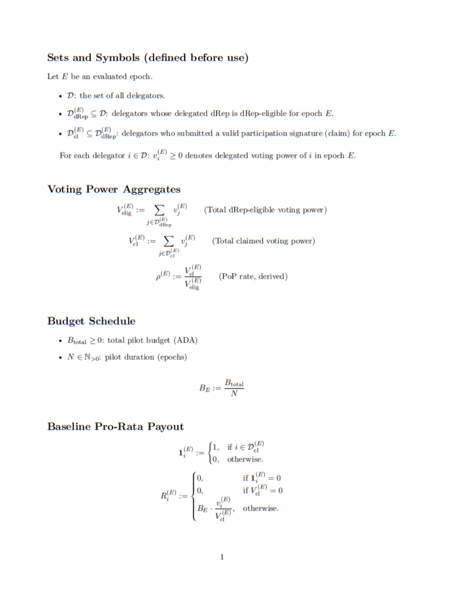

> # Distributing dRep influence with delegator incentives (Interim Mechanism)

Decentralization is not a decorative value in Cardano’s governance architecture. It is a structural objective. The transition to Voltaire was not merely about enabling on-chain voting — it was about redistributing influence away from founding entities and toward a broader, resilient set of independent actors.

Governance decentralization, however, is not achieved simply by enabling delegation. It depends on how voting power is distributed in practice.

When effective influence becomes highly concentrated in a small number of dReps, the system may remain formally decentralized while functionally converging toward influence clustering. This creates a tension between the theory of liquid democracy and its real-world behavioral outcomes.

Voting power concentration has been debated publicly, critiqued from multiple angles, and tied to resilience metrics rather than treated as a purely ideological preference.

Cardano’s long-term strategy, as defined in the Governance Action “Cardano 2030: Vision, Mission, Strategy Framework and KPIs”[1], explicitly treats voting power distribution as a resilience target, supported by distribution-oriented KPIs[2], and shaped through broad community discussion, feedback cycles, and numerical refinement.

In other words, decentralization of governance power is not a niche concern raised by a small subgroup. It is embedded in strategic documentation, actively debated across governance channels, and increasingly treated as a quantifiable system-health variable.

## Approaches to Improve Delegation Decentralization and Representation Quality

Community discussions around dRep voting power concentration often bundle together two distinct problems: (i) delegation distribution (excess concentration of effective voting power), and (ii) representation quality (participation, accountability, and decision discipline).

As a result, proposals typically fall into three broad intervention families:

1. Delegator-side incentives, designed to reduce delegation stickiness and induce redistribution toward smaller, active, transparent dReps.
2. dRep-side incentives and compensation mechanisms, designed to improve participation quality and sustain the work required for representation.
3. Influence-layer mechanics such as caps or saturation, designed to reduce concentration directly by limiting effective voting power above a threshold.

dRep performance and delegation distribution operate on different layers. Improving representation quality does not guarantee redistribution under sticky delegation, and redistribution incentives do not guarantee quality.

These three intervention families are complementary but target different layers, and they mirror tools already familiar from Cardano’s staking economics. They have theoretical merit and should remain part of the broader design conversation, but each carries distinct trade-offs and implementation friction.

This section maps the main bottlenecks and trade-offs across these layers to motivate an interim, delegator-side mechanism, without dismissing any of the approaches discussed.

## 1. Delegator-Side Mechanisms to Influence Delegation Behavior

Delegator-side interventions aim to change delegation behavior by altering incentives at the delegator layer. In practice, proposals tend to fall into two distinct approaches: (i) expanding reward flows to create positive incentives for delegation choices, and (ii) introducing access friction or conditionality around existing rewards to nudge participation. The subsections below outline both tracks and their trade-offs.

### 1.1 Reward Expansion: Generalized Delegation Rewards (SPO-Analogous Model)

One recurring proposal is to mirror the existing staking reward model used for SPO delegation by creating a reward stream for delegators to dReps, potentially paired with saturation-style mechanisms similar to the current staking model.

At first glance, this appears symmetrical and intuitive. However, implementing a protocol-native reward stream for dRep delegation would likely require changes tied directly to Cardano’s monetary policy — specifically inflation, issuance schedules, or reward-split allocations.

In practice, this introduces difficult choices:

- **Increasing emissions** (higher inflation / higher issuance),
- **Reallocating value** from existing reward streams, or
- **Creating a new recurring obligation** that competes with current staking rewards.

Given that baseline ADA staking rewards are already modest (currently in the range of roughly **~2–3% annualized**[3], depending on conditions), further dilution may render incentives negligible on both ends. Dividing an already low yield across additional mechanisms risks reducing meaningful incentive signals for both SPO delegators and potential dRep delegators.

This is not a normative claim about what “should” happen, but a practical observation about incentive strength: when reward rates are already low, marginal redistribution may not meaningfully alter behavior. In fact, it could weaken incentive clarity system-wide.

A more definitive assessment would require empirical community research regarding what level of annualized return is considered behaviorally meaningful. However, under current emission dynamics, the margin appears narrow.

### 1.2 Access Friction: Conditioning Staking Rewards Eligibility (Negative Incentive Track)

A separate line of discussion proposes not expanding rewards, but increasing **friction** around access to existing staking rewards. Variants include requiring periodic re-delegation or other recurring actions to remain eligible for staking rewards.

While this approach may appear “cheap” from a monetary-policy perspective (since it does not require higher emissions or a new reward stream), it functions as a **negative incentive** and introduces behavioral risks. Users may respond by delegating to any dRep (or the first visible option) purely to “unlock” rewards, increasing delegation noise rather than improving decentralization or due diligence.

Because it retrofits new recurring obligations onto a reward expectation that has been socially normalized over years, it can also generate irritation-driven shortcuts and reduce trust in the stability of the incentive system. For these reasons, this proposal does not treat staking-access friction as a promising path for decentralization-oriented delegation improvements.

## 2. dRep-Side Incentives and Compensation (Quality-Oriented Track)

A parallel set of community efforts focuses on incentives and compensation for dReps themselves, often coupled with proposals aimed at improving decision quality, participation cadence, and accountability tooling. These mechanisms are directionally valuable, particularly where governance suffers from low voting turnout, missing rationales, and uneven representation discipline.

However, this track primarily targets dRep behavior rather than delegator switching behavior. Even under stronger dRep incentives, delegation may remain concentrated due to inertia, visibility dynamics, and the low frequency with which delegators re-evaluate representation choices. This creates a practical gap: quality improvements can be real while distribution remains sticky.

For that reason, dRep incentive systems are treated here as complementary, not as a substitute for a redistribution-focused lever.

This document therefore prioritizes a delegator-side lever, treating dRep-side incentive design as a parallel track rather than the primary mechanism for redistribution.

## 3. Saturation Caps on dRep Effective Voting Power

A third intervention family is influence-layer mechanics, most commonly framed as saturation caps on effective dRep voting power.

Conceptually, this approach preserves liquid democracy principles: delegators remain free to delegate to any dRep they prefer. No delegation is censored or invalidated. Instead, effective influence above a defined threshold would not translate proportionally into additional governance weight — similar in spirit to how SPO saturation limits optimize but do not prohibit delegation.

From a decentralization perspective, a cap may indeed be the more structurally coherent instrument. It addresses concentration directly at the influence layer rather than attempting to shape behavior indirectly through incentives.

However, implementing such a cap introduces systemic governance implications. It requires recalibration of Governance Action quorum definitions and approval thresholds, which have already undergone substantial deliberation in the Voltaire era. Any modification would likely trigger renewed debate, transitional instability, and resistance from stakeholders wary of governance parameter changes.

A further consideration is behavioral: saturation caps would likely create incentives for **ID splitting**. dReps could fragment their representation across multiple identities to preserve aggregate influence under the cap, introducing a potential Sybil-style surface (even if the precise threat model and mitigations are out of scope here and have been discussed elsewhere).

Some observers may be tempted to treat this as analogous to SPO “pool splitting,” which already exists in the Cardano ecosystem and has become, to some extent, socially tolerated (with varying degrees of reputational pushback). However, the analogy is imperfect. A stake pool provides an operational service under economic competition, where some level of multi-pool strategy has been normalized as part of a profitability vs. decentralization equilibrium.

dRep representation is fundamentally different: it is not a service provider role in the same sense, but a **social representation function** based on identity, accountability, and legitimacy. Fragmenting identities primarily to maximize influence can be interpreted as a breach of the social contract underpinning liquid democracy, and may trigger stronger community resistance than pool splitting does in the SPO context.

This remains an empirical question and community norms may evolve, but it is important to acknowledge that caps can shift incentives toward identity fragmentation, creating both governance and legitimacy risks that are not cleanly comparable to SPO dynamics.

In short: beyond governance-math recalibration, caps may also introduce a second-order challenge: **identity fragmentation incentives** (and the associated Sybil/framing risks) in a domain where representation legitimacy matters as much as raw stake.

Thus, while a cap may remain a viable long-term direction — and arguably deserves continued discussion — its implementation carries significant friction and coordination cost.

## Why an Interim Approach

Recent snapshots show high dRep voting power concentration:

**~51% of voting power controlled by the top 11 dReps**[4]

The Cardano 2030 strategy explicitly treats voting-power distribution and active participation as resilience priorities.

Given the trade-offs outlined in previous sections:

- **Monetary-policy-linked reward expansion** faces inflation sensitivity and incentive dilution risk.
- **dRep-side incentive/compensation schemes** may improve participation and accountability, but do not directly address delegation inertia and concentration.
- **Hard caps** introduce governance recalibration complexity, transition friction, and may incentivize identity fragmentation.

This document proposes an interim delegator-side mechanism aimed at reducing delegation inertia and improving voting-power distribution, while applying eligibility signals that favor active and accountable representation.

This proposal does not claim to “solve” voting power concentration through protocol-level caps, nor does it assume that protocol-native generalized delegation rewards are currently the most feasible lever. While dRep-side incentive and compensation models can improve representation quality, they do not reliably induce redistribution under sticky delegation. This document therefore frames a delegator-side incentive mechanism as a pragmatic, lower-friction intermediate step.

While improving dRep work quality is important, prioritizing quality incentives before redistribution incentives is unlikely to materially shift voting power concentration under sticky delegation. A redistribution-first lever targets centralization directly and can generate secondary quality effects through eligibility requirements (activity and rationale presence).

While the primary objective is redistribution, the mechanism is not quality-neutral. Eligibility gates (recency of voting activity and the presence of a rationale attached to the most recent vote) create second-order pressure toward participation discipline and baseline transparency. This is not framed as a comprehensive “quality system” or a subjective scoring model. It is an intentional side effect of a redistribution lever: rewarding redelegation toward dReps that demonstrate minimum activity and accountability signals.

Finally, the 2030 KPI framework itself acknowledges that the measurement system is expected to evolve, with additional KPIs and improved dashboards to be developed, rather than assuming the first iteration is final.

This proposal fits that pragmatic posture: ship an actionable mechanism, observe effects, iterate, and avoid indefinite stalling while concentration and delegation ossification persist.

In that sense, it is a low-hanging fruit relative to the alternatives — not because it is perfect, but because it may be implementable without reopening foundational protocol debates.

## Threshold-Based dRep Delegation Incentives

Current dRep delegation remains highly concentrated and exhibits strong inertia, with the top 11 dReps controlling over ~50% of delegated voting power[4]. Asking top dReps to “relinquish power” is normative, not mechanical. This model proposes an incentive mechanism to promote redistribution without altering monetary policy or introducing hard caps. This design intentionally limits scope to one objective: incentivize decentralizing delegation. It is a starting point, not an all-encompassing incentives architecture.

## Core Concept

Create a temporary Bonus Pool for delegators who delegate to eligible dReps:

**Delegate to smaller + active + transparent dReps → receive a proportional bonus.**

## Primary Goal & Design Principle

### **Primary Goal:** 

- Induce controlled redistribution toward smaller, active, and transparent dReps.

### Design Rationale for Eligibility Signals

This mechanism is designed to incentivize redistribution while also creating minimum participation and accountability pressure on both sides of the system: **dReps** and **delegators**.

Its logic is aligned with recent research by **IOG Input Output Research**, *“Reward Schemes and Committee Sizes in Proof-of-Stake Governance”*[5], where the researchers investigate how to design a model that maximizes dRep effort. In that research, **effort** is modeled as a combination of:

- Attracting delegation, and
- Performing Governance Action reviews.

This interim mechanism applies a similar idea, fostering effort, but in a simpler and more operational way.

Instead of trying to measure representation quality directly through subjective review, the mechanism uses **observable, rule-based proxies** for effort and accountability:

- **dRep effort proxies:** sustained voting participation and written rationales for final recorded votes.
- **Delegator effort proxy:** a participation signature (claim / proof-of-participation) during the relevant epoch.

This choice is intentional. Measuring “quality” directly would require subjective judgments, reviewers, committees, or scoring systems, which would significantly increase complexity, cost, and political friction.

By using binary, verifiable conditions, the model preserves clarity and reduces disputes.

### Why the dRep Requirements Are Strict

The model requires that eligible dReps:

- **Do not** miss Governance Action voting deadlines (within the evaluated period), and
- Publish written rationales for final recorded votes.

This is not meant to impose a subjective quality standard or force technical expertise on every Governance Action. The requirement is intentionally minimal.

A dRep may still vote **ABSTAIN** and explain, for example:

- Lack of technical expertise,
- Insufficient time for deeper review,
- Conflicting priorities,
- Or any other reason.

The mechanism does **not** evaluate whether the rationale is “good,” “correct,” or “convincing.”

It only requires the **presence** of a written rationale attached to the final recorded vote.

Displaying the dRep’s voting rationales on the same screen as the claim feature also creates indirect pressure for quality, more on that on the next section.

In that sense, the model is not asking for excellence. It is asking for a minimum standard of representation:

- Show up,
- Cast a final vote before the deadline,
- Leave a written accountability trail.

### Why Delegator Participation Also Requires Effort

The model also avoids treating delegators as passive recipients of the bonus.

To receive the bonus for an evaluated epoch, the delegator must submit a valid participation signature through the mechanism interface during the defined epoch window. This functions as a **minimal effort signal** from the delegator side.

That signature serves multiple purposes:

- Confirms active participation in the mechanism,
- Prevents purely passive payouts,
- Supports final payout calculation based only on eligible participants, and
- Creates a natural interface for transparency (showing the delegated dRep’s recent votes and rationales).

Displaying the dRep’s voting rationales on the same screen as the claim feature also creates indirect pressure for quality. Even a brief exposure gives delegators a chance to see what is being written as evidence of dRep work. If a dRep repeatedly writes nonsense or provides extremely shallow/monosyllabic rationales, this may trigger a response from delegators.

As a result, the mechanism rewards not only delegation position, but also **active participation in the redistribution process**.

### Why This Improves the Model’s Practicality

By using effort proxies instead of subjective evaluation, the mechanism becomes:

- **More predictable** (clear binary rules),
- **More auditable** (verifiable conditions),
- **Less contentious** (no quality committee or scoring disputes), and
- **More implementable** as a pilot.

This is especially important because the proposal is intentionally framed as a **time-bounded Treasury-funded experiment**, not a permanent governance reward architecture.

The purpose is to test whether a targeted, eligibility-gated incentive can:

- Reduce delegation inertia,
- Improve voting-power distribution, and
- Create baseline accountability pressure,

Without requiring protocol-level reward changes or subjective governance-quality scoring.

## Non-Goals

- **No permanent yield system:** This is a temporary, test-oriented incentive. It is designed to run for a defined period, measure the impact on delegation behavior, and then be adjusted, extended, or discontinued based on observed results. The goal is to trigger redelegation, not to create a new long-term reward expectation.

- **No subjective quality scoring:** The mechanism does not rank dReps by “best/worst” or rely on human judgment, committees, ratings, or reputation scores. Eligibility is based on simple, observable signals (for example: being below the voting-power threshold and publishing written rationales for votes), so the rule is predictable and hard to argue about.

- **No inflation or staking reward changes:** The design does not require changing ADA issuance, monetary policy, or how staking rewards are split today. The bonus pool is treated as a separate governance incentive budget, rather than taking value from existing staking rewards or increasing emissions.

- **Not a rewards framework for dReps themselves, Constitutional Committee members, or SPOs:** It is strictly a delegation incentive mechanism (delegator-side), analogous in spirit to how staking incentives influence stake delegation behavior. The reason is pragmatic: bundling multiple incentive systems into one proposal dramatically increases complexity and stalls adoption. We have already seen compensation discussions (e.g., for Constitutional Committee participation) criticized for not also covering dRep rewards. If this proposal is expected to simultaneously define reward structures for dReps, the CC, and SPOs, it becomes an endless scope expansion where every group asks “what about us?” and nothing ships.

- **No vote-buying:** Rewards are tied to delegation choices and basic accountability signals, not to voting outcomes (YES/NO/ABSTAIN) or alignment with any specific agenda.
- 

## Scope Note 

This document is a non-final draft for community discussion, not a final implementation plan.

Several elements are intentionally left as open design variables to be defined through public feedback and governance debate, including (but not limited to): pilot budget size, pilot duration, threshold calibration, and success metrics/KPIs.

Operational implementation details (including who operates the mechanism, tooling choices, and execution infrastructure) are explicitly out of scope at this stage. The purpose of this MVP is to define the incentive logic clearly enough to evaluate feasibility, surface trade-offs, and solicit informed input before freezing parameters or committing to an implementation path.

---

# Model Specification

## Step 1 — Bonus Pool (Pilot Funding Design, Scope, and Source)

### 1.1 Parameter Definition

The model begins by defining a fixed Bonus Pool allocation for a pilot period. This parameter establishes the mechanism’s funding source and budget scope without changing protocol inflation or staking reward splits. It is a paid mechanism to accelerate decentralization, but it is scoped to a narrower eligible subset to minimize cost relative to generalized, protocol-wide delegation rewards. 

The Bonus Pool is funded as a dedicated incentive budget line (e.g., a Treasury-funded pilot), explicitly separated from Cardano protocol-native staking rewards and monetary policy parameters.

The Bonus Pool size and parameterization remain open design variables under community debate: the incentives must be high enough to overcome current redelegation inertia, while being optimized to minimize treasury drawdown and avoid creating a permanent reward expectation.

This mechanism is intentionally temporary and experimental. It is designed as a time-bounded financial incentive to reduce delegation inertia and test whether a targeted bonus can improve dRep voting-power distribution.

The pilot is structured as an **$N_{epochs}$ test period**, with duration left open for community debate. The duration should be long enough to test the mechanism under real conditions, including:
- the period required for the reward decay curve to take effect, and
- an additional observation window to assess delegator behavior as returns decline over time.

The Treasury allocation requested for the pilot is not expected to be directed entirely to delegator payouts. Most of the budget should be allocated to the Bonus Pool itself, while a limited portion may be reserved for minimal operational requirements needed to run the mechanism.

These operational requirements may include:
- eligibility monitoring (dRep and delegator conditions),
- a delegator claim interface,
- and basic transparency tooling to verify delegated dRep voting activity and rationale publication.

Implementation should remain as lean as possible. Existing open-source tools and reusable infrastructure should be prioritized whenever possible to minimize overhead and maximize the share of funds allocated to the incentive itself.

---

### 1.2 Funding Rationale

This design uses a paid incentive deliberately. The objective is not to create a permanent reward layer, but to run a targeted Treasury-funded pilot that tests whether delegation behavior can be shifted through a bounded redistribution incentive.

In that sense, the mechanism may be criticized as “buying decentralization.” In narrow terms, it is a financial incentive and should be described plainly as such. The design choice is to apply that incentive surgically (eligibility-gated, time-bounded, and pilot-scoped) rather than through broader protocol-native reward expansion.

This approach is also intended to avoid higher-friction alternatives, such as changing protocol inflation, modifying staking reward splits, or introducing hard caps on dRep effective voting power.

A likely criticism of this design is that it introduces “too many parameters” or makes eligibility too restrictive. That selectivity is intentional, and it follows from the funding source and the incentive design constraints.

This mechanism is proposed as a **Treasury-funded pilot**, not as a protocol-native reward extension. That distinction matters.

Cardano already has an established monetary distribution system in which protocol emissions fund staking rewards (split between SPO economics and delegator rewards) while another portion flows to the Treasury. Modifying the staking reward structure to introduce generalized dRep delegation rewards would require touching monetary-policy-linked incentives that are already deeply embedded in Cardano’s economic model.

This proposal intentionally avoids that path. Changing protocol-native reward flows would create much higher coordination risk, political resistance, and potential trust concerns around precedent. For that reason, the mechanism is designed as a separate Treasury-funded pilot.

However, using the Treasury creates a different constraint: **budget discipline**.

Based on the reward-allocation data referenced in this document, the protocol currently allocates on the order of **~15 million ADA per epoch** to staking rewards (before downstream distribution across SPOs and delegators)[6]. This is a large recurring issuance flow. Replicating a staking-analogous yield for all dRep delegators through a Treasury-funded mechanism would likely require a budget that is politically difficult to justify and operationally difficult to sustain.

For that reason, the model is designed to be selective on purpose.

The stacked eligibility conditions are not arbitrary complexity. They serve three goals at once:

- **Incentive targeting:** concentrate rewards on behavior the mechanism wants to induce (redelegation toward smaller dReps, active participation, and written accountability).
- **Treasury efficiency:** reduce the eligible set so the same pilot budget can produce a stronger per-delegator incentive signal.
- **Operational viability:** keep the pilot financially bounded and politically defensible as a temporary experiment.

In other words, stricter eligibility is not just a governance preference. It is what makes a Treasury-funded pilot realistically deployable while still offering a bonus large enough to matter.

This is also why the mechanism uses effort/accountability proxies on both sides (dRep and delegator) instead of a broad passive payout model. A narrower eligible subset allows the pilot to preserve incentive strength without requiring a Treasury allocation large enough to resemble a protocol-wide rewards program.

As of February 2026 [7], ADA is trading close to the lower end of its historical range relative to the period in which Treasury-funded ecosystem programs (e.g., Project Catalyst) have been active. This tends to increase budget scrutiny and political resistance to Treasury-funded experiments, even when they are time-bounded and narrowly scoped.

That scrutiny is understandable, especially under tighter market conditions. But evaluating this mechanism only through a “spend vs. don’t spend” lens is too narrow. The relevant comparison is not simply cost vs. zero cost. It is the cost of a targeted, time-bounded incentive mechanism versus the implicit cost of allowing governance influence to remain highly concentrated and operationally inert, without clear dynamics pushing for decentralization, participation, or accountability.

That implicit cost is difficult to quantify precisely. It includes second-order effects such as weaker resilience, weaker legitimacy, slower behavioral adaptation, and the long-run consequences of decisions made by a narrow, solid cluster of dReps.

Because these factors depend on many variables and include subjective dimensions, a precise “price tag” is unlikely to be computable. Yet the absence of a clean metric does not imply the absence of a real cost.

At minimum, this pilot introduces mechanical pressure toward behaviors the system currently struggles to induce consistently: redelegation, consistent dRep voting activity, and basic written rationales attached to votes, for accountability and transparency purposes. Governance Actions often struggle to reach quorum, and participation quality remains uneven across the registered dRep set.

In practice, the ecosystem has increasingly relied on informal social enforcement and public shaming to prompt inactive dReps to vote. A delegation-side threshold incentive does not eliminate social norms, but it reduces the need to depend on them as the primary accountability mechanism by tying eligibility to objective, verifiable participation signals.

Even if imperfect, it creates a testable intervention with observable outcomes, which is preferable to relying exclusively on informal norms while concentration persists.

In short, the Bonus Pool is designed as a Treasury-funded pilot with narrow scope and minimal operational overhead: enough to run and evaluate the mechanism, but not to create a permanent administrative or reward structure.

## Step 2 — Delegator Bonus Eligibility

A delegator qualifies for the Bonus Pool in a given epoch only if all conditions below are met.

### 2.1 Delegated dRep Conditions

The delegator must be delegating to a dRep that satisfies all conditions below at the evaluation point.

### - Threshold Condition

To qualify for the Bonus Pool, a delegator must be delegating voting power to a dRep whose total delegated voting power is below the threshold **T**.

The threshold $T$ is fixed during the pilot period to preserve clarity, predictability, and ease of communication.

### - Activity Condition

The delegated dRep must remain actively compliant during the evaluated **N**-epoch period.

For bonus eligibility purposes, this means the dRep must not miss any Governance Action voting deadline that closes during the evaluated **N**-epoch period.

Eligibility is lost if a Governance Action reaches the end of its dRep voting window during the evaluated **N**-epoch period and the dRep still has no final recorded vote (with rationale) on that action.

This avoids ambiguity around *when* a dRep chooses to vote. A dRep may vote earlier or later within the allowed voting window, as long as a final vote is recorded before that Governance Action’s dRep voting window closes.

In other words, a dRep is not required to vote in every epoch, only to avoid missing deadlines for Governance Actions that close during the evaluated period

### - Transparency Condition

The delegated dRep must publish a written rationale, of any character size above 0, for every **final recorded vote** on Governance Actions whose dRep voting window closes during the evaluated period.

This is intentional:

- not “at least one rationale,”
- not “a historical rationale,”
- but a written rationale attached to each final recorded vote that counts for eligibility in the evaluated period.

Only final recorded votes are considered for this rule.  
If a dRep submits or updates a vote during the epoch, what matters for eligibility is the **final recorded version** of that vote before the Governance Action voting window closes.

This means:
- if a dRep initially submits a vote without a rationale but later updates it (before the deadline) with a rationale, eligibility is preserved;
- if a dRep initially submits a vote with a rationale but later updates it (before the deadline) to a final version without a rationale, eligibility is lost.

Only the **presence** of written rationales is required. No qualitative scoring or subjective review is part of this model.

---

### Activity and Requalification Rule (N-Epoch Recovery Window)

Eligibility loss is immediate for bonus purposes if the dRep fails either condition above (missed final vote by deadline, or final recorded vote without written rationale).

However, eligibility is **not restored immediately** after a single compliant epoch.

To restore eligibility, the dRep must satisfy all required conditions again across a full **N-epoch recovery window**.

In practice, this means that across the recovery period, the dRep must:
- cast final votes on all Governance Actions whose dRep voting windows close during that period, and
- publish written rationales for all such final recorded votes.

In other words:
- **failure causes immediate loss**, but
- **recovery requires a clean N-epoch track record**.

### 2.2 Delegator Conditions

### Delegation Status Condition

To qualify for the Bonus Pool, a delegator must be actively delegating voting power to a dRep that satisfies the delegated dRep conditions in Section 2.1.

### Participation Signature Condition (Claim / Proof-of-Participation)

To receive the bonus for the current epoch, the delegator must submit a valid signed transaction (or equivalent cryptographic signature) through the mechanism interface during the current epoch.

This signature serves as a proof of participation in that epoch, confirming the delegator’s intent to claim the bonus and enabling final payout calculation based only on eligible, participating delegators.

The signature does not require immediate payout. Instead, it functions as an eligibility checkpoint for that epoch. Final payout occurs in a subsequent distribution step, after the participation epoch window closes and the eligible set is finalized.

This design allows the mechanism to:

- Verify active delegator participation,
- Expose the delegated dRep’s recent voting actions and written rationales in the interface,
- Optimize payout execution by calculating distributions after the full eligible participant set is known.

If the delegator does not submit a valid participation signature within the defined window, no bonus is paid for that epoch.

## Step 3 — Reward Formula (Pilot Baseline)

This section defines how the Bonus Pool is distributed among eligible delegators for each evaluated epoch.

The pilot version uses a **simple pro-rata formula**. The goal is to keep the mechanism easy to understand, auditable, and implementable before adding optional complexity.

---

### 3.1 Epoch Bonus Allocation

For each evaluated epoch **E**, the mechanism defines a fixed bonus allocation:

- $Pool(E)$ = the Bonus Pool amount assigned to epoch $E$ (from the pilot budget split across epochs).

This is the total amount available for distribution to eligible delegators for that evaluated epoch.

---

### 3.2 Eligible Delegator Set for Epoch E (Claim-Adjusted)

A delegator is included in the eligible payout set for evaluated epoch **E** only if **both** layers below are satisfied:

1) **Delegated dRep eligibility (on-chain, evaluated for epoch E)**  
   The delegator must be delegating to a dRep that satisfies the dRep-side eligibility rules defined in **Step 2**, including:
   - total delegated voting power below threshold **T**, and  
   - compliance with the activity + written-rationale requirements over the evaluated period (e.g., the last **N** epochs), based on **final recorded votes** before Governance Action voting deadlines.

2) **Delegator participation (claim) for epoch E (captured in epoch E+1)**  
   The delegator must submit a valid participation signature (claim) during the claim/participation window in epoch **E+1**, explicitly linked to the payout for evaluated epoch **E** (as specified in **Step 5**).

For clarity, define:

- $Eligible(E)$: the set of delegators who are eligible **and** successfully claimed for the payout corresponding to epoch $E$ (i.e., “eligible-and-participating”).  
- $V_i(E)$: delegated voting power of delegator *i*, used as payout weight for epoch **E**.  
- $V_{cl}(E)$ : total claimed voting power for epoch E, defined as:  
 

$$
 V_{cl}(E) = \sum_{j \in Eligible(E)} V_j(E)
$$

> **Formal reference:** The precise set definitions and aggregates used by this mechanism are specified in **Appendix A (Figure A1)**.

---

### 3.3 Baseline Pro-Rata Distribution Formula

### What the formula is doing (plain language)

The pilot uses a **simple pro-rata split**: each eligible delegator receives a share of the epoch bonus pool proportional to their voting power **within the claimed eligible set**.

That means:

- the epoch bonus pool $Pool(E)$ is fixed by design, and  
- each payout depends on a delegator’s voting power relative to the **total claimed voting power** in that epoch.

### Variable glossary (pilot baseline)

- $B_{total}$: Total Bonus Pool for the entire pilot (ADA).  
- $N_{epochs}$: pilot duration in epochs.  
- $Pool(E)$: Bonus Pool allocation for evaluated epoch **E**. Baseline schedule:  
  $$
  Pool(E) = \frac{B_{total}}{N_{epochs}}
  $$
- $T$: dRep voting-power threshold (fixed during the pilot).  
- $Eligible(E)$: set of delegators who (i) delegated to an eligible dRep for epoch $E$ and (ii) submitted a valid claim in epoch $E+1$ for the payout corresponding to epoch $E$.  
- $Vᵢ(E)$: delegated voting power of delegator *i*.  
- $V_cl(E)$: total claimed voting power:  
  $$
  V_{cl}(E) = \sum_{j \in Eligible(E)} V_j(E)
  $$
- $Rewardᵢ(E)$: payout amount for delegator *i* for evaluated epoch **E**.

### Step-by-step interpretation (how it translates into a payout)

1) **Community defines the pilot budget**  
   Through public discussion and governance process, the community sets the total pilot allocation $B_{total}$.

2) **Community defines the pilot duration**  
   The community sets the pilot length in epochs: $N_{epochs}$.

3) **Compute the epoch allocation**  
   With budget and duration defined, the baseline per-epoch pool is computed:
   $$
   Pool(E) = \frac{B_{total}}{N_{epochs}}
   $$

4) **Fix the dRep threshold T (pilot parameter)**  
   A threshold $T$ is selected (and held fixed during the pilot for clarity), defining the target dRep eligibility band.

5) **Determine eligible dReps (on-chain verification)**  
   For each evaluated epoch $E$, the mechanism checks which dReps satisfy the activity + rationale rules (based on final recorded votes before deadlines) and remain below threshold $T$.

6) **Determine the eligible delegator set for epoch $E$**  
   A delegator qualifies for the payout corresponding to epoch $E$ only if:
   - they were delegating to a dRep that passes eligibility for epoch $E$, **and**
   - they submitted a valid claim signature during epoch $E+1$, linked to epoch $E$.

   The set of such delegators is $Eligible(E)$.

7) **Compute total claimed voting power**  
   The mechanism aggregates total claimed voting power:
   $$
   V_{cl}(E) = \sum_{j \in Eligible(E)} V_j(E)
   $$

8) **Distribute the pool pro-rata**  
   Each eligible delegator receives:
   $$
   Reward_i(E) = Pool(E) \times \frac{V_i(E)}{V_{cl}(E)}
   $$

> **Interactive simulator:** The spreadsheet simulator implements this baseline payout logic for scenario testing (budget, duration, threshold assumptions, eligible voting power, claimed voting power / participation rate, and projected yield metrics). 
> 
> You can use it to test assumptions for budget, duration, claimed voting power and projected yields.
> 
> *[Click here to access the simulator](https://docs.google.com/spreadsheets/d/1pZEh1VQiBkv-Zoti3aktQwCw1JOGh5pFsEdJDCc9VPw/edit?usp=sharing)*  
> 
> **Formal definition:** The normative LaTeX definition of sets, aggregates, and payout rule is provided in **Appendix A (Figure A1)**.

### Note on APR/APY (derived communication metrics)

APR and APY are **not part of the payout rule**. They are derived metrics used to communicate projected yields (e.g., yield per epoch, annualized APR/APY) based on the simulated payout outcomes.

---

### 3.4 Distribution Logic, Scope, and Reference Implementations

This baseline formula intentionally rewards only the subset of delegators who meet both layers of the mechanism:

- **Delegation into the eligible band:** the delegator is delegating to a dRep that satisfies the mechanism’s threshold, activity, and rationale requirements for the evaluated period; and  
- **Active participation (claim):** the delegator submits a valid participation signature during the claim window (in epoch $E+1$) for the payout corresponding to evaluated epoch $E$.

As a result, the incentive is scoped to a narrow, verifiable target behavior:

- **redelegation toward smaller eligible dReps**, and  
- **continued participation in the mechanism** via the claim step.

This is a redistribution accelerator, not a generalized delegation reward system.

### Reference implementations (formal definition and simulator)

To avoid ambiguity, this document provides two aligned references of the same baseline logic:

- **Formal definition (LaTeX):** See **Appendix A (Figure A1)** for the normative definition of the sets, aggregates, and payout rule.  
- **Interactive simulator (Excel):** See the linked spreadsheet for hands-on scenario testing and derived yield metrics. *([Click here to access the simulator](https://docs.google.com/spreadsheets/d/1pZEh1VQiBkv-Zoti3aktQwCw1JOGh5pFsEdJDCc9VPw/edit?usp=sharing))*

The spreadsheet is a community-facing tool for exploring outcomes. The LaTeX block is the technical reference intended to anchor interpretation and implementation alignment.

---

### 3.5 Optional Extensions (Parameter Layer, Not Required for Pilot v1)

The baseline pilot uses a plain pro-rata distribution on claimed voting power.  
However, the mechanism can support optional modifiers if the community chooses to expand the design.

These extensions are **not required** for the pilot baseline formula.

---

### 3.5.1 Decay Multiplier (Post-Redelegation Incentive Decay)

If the community wants stronger pressure toward periodic redelegation (instead of continuous “set-and-forget” claiming), a decay multiplier can be applied to reduce rewards as a function of time since the delegator’s last redelegation event.

Because eligibility and payouts are evaluated in discrete epochs, the decay is naturally **stepwise per epoch**, not continuous.

Let:
- $t$ = number of epochs since the delegator’s last redelegation event with $t=0$ at redelegation,
- $M(t)\in[0,1]$ = decay multiplier.

The payout becomes:
$$
Reward_i(E) = Pool(E)\cdot \frac{V_i(E)}{V_{cl}(E)} \cdot M(t)
$$

Example decay families (stepwise per epoch):

- **A) Linear step decay:** decreases by a fixed amount each epoch until reaching zero.  
- **B) Tiered (step) decay:** full bonus for $(L_1)$ epochs, reduced bonus for $(L_2-L_1)$ epochs, then zero.  
- **C) Exponential step decay:** multiplicative reduction each epoch.  
- **D) Curved decay (nonlinear step curve):** a smooth, non-linear decay profile evaluated at discrete epoch steps (e.g., concave or convex decay), selected for communicability and behavioral impact.

Decay is optional in pilot v1 and should only be introduced if the baseline pro-rata model fails to induce sufficient redelegation dynamics.

---

### 3.5.2 Participation Floor (Circuit Breaker for “Jackpot Epochs”)

In rare situations, the claimed denominator $V_{cl}(E)$ can become extremely small (e.g., low awareness, early pilot phases, or unusually low claim participation). Since the pool $Pool(E)$ is fixed, a very small denominator can produce unusually high implied yields for a small subset of participants.

To reduce political and reputational risk from extreme outlier epochs, the mechanism may optionally define a minimum claimed voting power threshold:

- $V_{\min}$: minimum claimed voting power required to execute a payout for epoch $E$.

If $V_{cl}(E) < V_{\min}$, the payout for that epoch is not executed and is handled under an exceptional funds-handling rule (defined in the Epoch Handling section). This acts as a system-level circuit breaker without introducing per-delegator caps or subjective evaluation.

---

### 3.5.3 Dust Claims (Scalability Consideration)

Under a recent pilot-style simulation made between epochs 609 and 615, with a relatively low threshold band (e.g., sub-10M dRep voting power), the observed number of delegating wallets in the eligible band remains limited. In that setting, dust claims do not appear to be a primary operational bottleneck.

Payouts are also expected to be executed in batches, further reducing the likelihood that per-recipient transfer costs become material relative to payout amounts.

Dust handling is therefore documented as a **scalability consideration**, not a pilot requirement. If the mechanism expands to higher thresholds or reaches materially higher adoption (large recipient sets), very small payouts may create avoidable operational overhead and poor user experience. At that point, the mechanism could introduce an optional dust rule, for example:

- a minimum payout threshold, or  
- a minimum delegated voting power threshold.

Any dust rule should be framed as an operational efficiency measure, not a subjective filter.

---

### 3.5.4 Boost Factors (Optional Behavioral Modifiers)

If future community feedback identifies specific behaviors as desirable and objectively measurable, the formula could support optional boost factors. These should only be considered if they remain rule-based, auditable, and do not introduce subjective scoring or committee judgment.

This is explicitly out of scope for pilot v1.

## Step 4 — Payout and Claim Rules

This section defines the operational flow for bonus eligibility confirmation and payout execution.

The mechanism uses a three-stage cycle:

- **Epoch $E$** = evaluated epoch (dRep compliance is evaluated here)
- **Epoch $E+1$** = participation signature / claim window
- **Epoch $E+2$ (or later)** = payout execution (batch distribution)

This structure ensures that bonus payouts are based on finalized eligibility data from the evaluated epoch, while allowing a separate participation window for delegators to confirm their claim.

### 4.1 Epoch Reference and Eligibility Freeze

Bonus eligibility is evaluated for a specific epoch $E$.

The delegator’s right to receive a bonus for epoch $E$ is determined based on:

- the delegator’s status in epoch $E$,
- the delegated dRep’s eligibility conditions in epoch $E$, and
- the delegator’s valid participation signature submitted during epoch $E+1$.

For payout purposes, eligibility for epoch $E$ is **frozen** at the end of epoch $E$.

This means:

- if the delegated dRep was eligible in epoch **E**, that eligibility remains valid for the payout linked to epoch $E$;
- if the delegated dRep loses eligibility in epoch $E+1$, this does **not** invalidate the delegator’s already-earned bonus for epoch $E$.

This rule avoids ambiguity and prevents retroactive loss of payout rights after the evaluated epoch has already closed.

### 4.2 Claim Window (Participation Signature Window)

To receive the bonus for epoch $E$, the delegator must submit a valid participation signature during the full duration of **epoch $E+1$**.

The participation signature is:

- a wallet-based signature (or equivalent cryptographic proof), and
- used as a required proof of participation for that specific epoch’s bonus.

The claim window is intentionally limited to **one epoch** $E+1$ to keep the mechanism simple, predictable, and easy to communicate.

If the delegator does **not** submit a valid participation signature during epoch **E+1**, no bonus is paid to that delegator for epoch **E**.

At least one front-end interface should exist to allow broader participation. 

### 4.3 Signature Validity Requirements

A participation signature is valid only if it:

- is submitted by the delegator’s wallet (the wallet associated with the delegation being evaluated),
- is submitted within the defined claim window (**epoch $E+1$**),
- is validly formatted and verifiable by the mechanism interface/backend, and
- is linked to the specific evaluated epoch ($E$) to prevent reuse across different epochs.

This epoch-specific linkage is required to prevent signature replay (i.e., reusing the same signature to claim rewards for multiple epochs).

### 4.4 Payout Calculation and Distribution Logic

After epoch $E+1$ closes, the mechanism finalizes the set of delegators who are eligible for the bonus tied to epoch $E$.

The payout amount for each eligible delegator is then calculated from the Bonus Pool allocation assigned to epoch $E$, according to the reward formula defined in the next section.

Important rule:

- the epoch’s Bonus Pool allocation is distributed only among delegators who were eligible for epoch $E$ **and** submitted a valid participation signature in $E+1$.

There is **no individual rollover** for delegators who fail to sign.

If a delegator does not submit a valid participation signature during the claim window:

- that delegator loses the right to the bonus for epoch $E$, and
- their share is effectively redistributed among the eligible participants who did sign the transaction in the current epoch.

This keeps each epoch’s payout self-contained and avoids creating claim backlogs or deferred individual balances.

### 4.5 Batch Payout Execution

Payouts are executed after the eligible set is finalized (after the close of epoch $E+1$), typically in epoch  $E+2$ or later depending on implementation and operational timing.

Payout execution should prioritize **batch distribution** to eligible addresses in order to reduce transaction costs and operational overhead.

The specific payout implementation (e.g., smart contract flow, multisig operator flow, or another execution method) is out of scope for this mechanism specification.

For the purposes of this model, it is sufficient to define that:

- payouts are executed in batch,
- they are based on the finalized eligible set for epoch $E$, and
- they are operationally administered by the mechanism operator/administrator.

### 4.6 Failure Cases and Invalid Claims

No bonus is paid for epoch **E** if the delegator’s participation signature is:

- missing,
- submitted outside epoch $E+1$,
- invalid or unverifiable, or
- not linked to the eligible delegator wallet for that epoch.

These rules are necessary to preserve auditability and prevent disputes.

Technical failure handling (e.g., front-end outage, wallet integration failure, or emergency extension policy) may be defined in implementation governance or operational documentation, but does not change the base rule of this model:

- a valid participation signature within the claim window is required to receive the bonus for the evaluated epoch.

### 4.7 Summary of the Payout Flow

For clarity, the payout flow works as follows:

1. **Epoch $E$ closes**  
   dRep and delegator eligibility conditions for epoch **E** are evaluated and frozen.

2. **Epoch $E+1$ (claim window)**  
   Eligible delegators submit a participation signature through the interface to claim the bonus for epoch **E**.

3. **After $E+1$ closes**  
   The final eligible participant set is determined.

4. **Epoch $E+2$ (or later)**  
   Batch payout is executed to eligible delegators who submitted valid signatures.

This design keeps the mechanism auditable, operationally lean, and aligned with the pilot nature of the proposal.

## Step 5 — Key Mechanism (Epoch Flow Logic)

This section summarizes the operational flow of the mechanism across epochs, linking eligibility checks, delegator participation, and payout timing.

The mechanism follows a simple three-step epoch sequence:

- **$E$ (Evaluated Epoch):** dRep behavior is evaluated for eligibility purposes.
- **$E+1$ (Participation / Claim Epoch):** eligible delegators submit a participation signature.
- **$E+2$ (Payout Epoch):** batch payout is executed for epoch **E** (subject to implementation timing).

This structure keeps the logic auditable and avoids paying rewards before eligibility conditions are fully observable.

---

### 5.1 Epoch E — Evaluated Epoch (dRep Compliance Check)

Epoch **E** is the reference epoch for bonus eligibility evaluation.

During this stage, the mechanism determines whether the delegated dRep satisfies the required conditions for bonus eligibility, including:

- threshold condition (delegated voting power below **T**),
- activity condition (no missed Governance Action voting deadline within the evaluated period),
- transparency condition (written rationales attached to final recorded votes).

What matters is the **final recorded vote state** by the time each relevant Governance Action voting window closes.

This means eligibility is based on finalized, observable outcomes — not intermediate vote drafts or temporary states.

---

### 5.2 Epoch E+1 — Delegator Participation Window (Claim / Proof-of-Participation)

If the delegated dRep was eligible for epoch $E$, the delegator may participate in the bonus process during epoch $E+1$.

To do so, the delegator must submit a valid participation signature through the mechanism interface during the $E+1$ window.

This signature:

- confirms the delegator’s intent to claim the bonus for epoch $E$,
- proves active participation in the mechanism,
- and finalizes the eligible participant set for payout calculation.

The interface may also display the delegated dRep’s recent voting actions and written rationales, reinforcing diligence and transparency at the moment of participation.

If the delegator does **not** submit the participation signature during $E+1$, no bonus is paid to that delegator for epoch $E$.

---

### 5.3 Epoch E+2 — Payout Execution (Batch Distribution)

After epoch $E+1$ closes, the mechanism has the finalized set of:

- eligible dReps (from epoch $E$), and
- eligible delegators who completed participation signature (during $E+1$).

The payout for epoch $E$ can then be calculated and executed in batch form (typically in epoch $E+2$, depending on implementation).

This batch approach is preferred because it:

- reduces transaction overhead relative to individual instant claims,
- allows a single finalized reward calculation for all participants,
- and keeps the mechanism operationally lean.

The exact reward amount per delegator is determined by the reward formula.

---

### 5.4 Why the E / E+1 / E+2 Structure Is Used

This sequence is intentional and solves a practical problem:

- eligibility cannot be confirmed until the evaluated epoch closes,
- participation signatures must be collected after eligibility is known,
- and payout should occur only after the final participant set is fixed.

In short:

- $E$ = evaluate dRep compliance,
- $E+1$ = delegator signs to claim for $E$,
- $E+2$ = execute payout for $E$.

This keeps the mechanism simple, time-ordered, and compatible with a pilot implementation.

---

### 5.5 Exceptional Handling Link

Exceptional cases (such as no eligible delegators in an evaluated epoch, or technical payout delays) are handled under **Step 6 — Epoch Handling**, and do not change the core E / E+1 / E+2 logic.

The default rule remains:

- evaluate first,
- collect participation second,
- distribute after finalization.

## Step 6 — Epoch Handling (Normal and Exceptional Cases)

This section defines how the mechanism handles epoch-level payout flows under normal conditions and rare edge cases.

### 6.1 Normal Epoch Flow

For each evaluated epoch $E$:

- dRep eligibility is assessed based on the model rules (threshold, activity, and rationale requirements),
- delegator eligibility is derived from the delegated dRep’s status, and
- only delegators who submit a valid participation signature during $E+1$ qualify for payout.

The payout for epoch $E$ is then distributed in batch form after the $E+1$ participation window closes (typically in $E+2$, depending on implementation).

If at least one delegator is eligible and submits a valid participation signature, the full Bonus Pool allocation assigned to epoch $E$ is distributed among eligible participants according to the reward formula.

---

### 6.2 No Individual Rollover

There is no individual rollover.

If a delegator does not submit a valid participation signature during the claim window for epoch $E$ (i.e., during $E+1$), that delegator permanently loses the right to receive their share for epoch **E**.

That unclaimed portion is not reserved for later individual recovery. It is redistributed within the same epoch payout calculation among the other eligible delegators who completed the participation signature requirement.

---

### 6.3 Rare Exception — No Eligible Delegators in the Evaluated Epoch

This is expected to be a rare exception.

If, for a given evaluated epoch, no delegator qualifies for payout because no delegated dRep satisfies the eligibility conditions during the relevant evaluation period, then no payout is executed for that epoch.

This may occur in exceptional governance gaps (for example, an unusually long period with no Governance Actions closing voting windows, or no dRep meeting the required activity/transparency conditions).

In that case:

- the Bonus Pool allocation assigned to that epoch is **not distributed**, and
- the undistributed amount is kept separate and later **returned to the Treasury**, since the mechanism is Treasury-funded and no eligible governance participation occurred during that period.

This rule prevents unnecessary spending during periods with no practical governance activity and preserves the pilot’s fiscal discipline.

---

### 6.4 Operational Failures or Delays (Implementation-Level)

If payout execution is delayed due to technical or operational failure (e.g., interface outage, batch processing issue, or infrastructure problem), eligibility for the evaluated epoch remains based on the already finalized rules and participation records for that epoch.

In such cases:

- eligibility is not recalculated due to the delay,
- the payout remains owed to the eligible participant set already determined, and
- distribution should be executed as soon as the issue is resolved.

This prevents participants from being penalized for implementation failures outside their control.

---

## Design Tradeoffs

### Treasury Cost

**Tradeoff (what is sacrificed):**  
The pilot spends Treasury funds to subsidize delegation behavior, which can draw scrutiny under tighter budget conditions and may be framed as “buying decentralization.”

**Counter-argument (why it’s acceptable):**  
The Treasury exists to fund public goods and governance interventions when protocol-native incentives do not correct structural behaviors like sticky delegation. This mechanism is explicitly **time-bounded, budget-bounded, and reversible**, with measurable outcomes (distribution shifts, participation, concentration metrics). Compared to altering monetary policy, reward splits, or governance thresholds, a Treasury-funded pilot is a **lower-irreversibility** path: it can be evaluated empirically and discontinued without setting protocol-level precedent.

---

### Bonus-Driven Delegation Behavior

**Tradeoff (what is sacrificed):**  
Some delegators may optimize purely for the bonus, delegating based on yield rather than representation affinity or thoughtful evaluation.

**Counter-argument (why it’s acceptable):**  
Incentives are designed to change behavior. If a mechanism does not attract opportunistic participation, it often fails to move behavior at all. Here, “optimization” is aligned with the intended system effect: **redelegation away from concentrated power toward smaller eligible dReps**. Even when motivations are purely financial, the aggregate outcome still produces what the pilot is testing: reduced inertia and improved distribution towards more engaged dReps with less voting power.

---

### Minimal or Low-Effort Rationales

**Tradeoff (what is sacrificed):**  
Because eligibility checks only for the *presence* of a rationale (not its quality), some rationales will be shallow, boilerplate, or minimally informative.

**Counter-argument (why it’s acceptable):**  
Quality assessment introduces subjective judgment, committees, scoring disputes, and political friction. The pilot is not a comprehensive “quality evaluation system”; it enforces **minimum, verifiable accountability**. Requiring a rationale creates a public accountability trail, increases reputational cost for nonsense, and generates data for later tooling and analysis. The goal is to establish a baseline transparency floor without turning the mechanism into an argument about what “good reasoning” is.

---

### Threshold-Edge Clustering Around a Fixed **T**

**Tradeoff (what is sacrificed):**  
A fixed threshold **T** can attract delegation into the eligible band and create mild crowding near the cutoff, producing local clustering effects.

**Counter-argument (why it’s acceptable):**  
The primary risk today is extreme clustering at the top of the distribution, not mild crowding near a pilot cutoff. A fixed **T** improves predictability, communication clarity, and auditability, which matters for adoption and legitimacy in a pilot. If clustering appears, it becomes **useful telemetry**: evidence for calibrating **T**, adjusting eligibility bands, or adding optional dynamics (decay, floors) in later iterations, without requiring protocol-level caps.

---

## Redistribution-First Focus (Not Performance Scoring)

**Tradeoff (what is sacrificed):**  
The mechanism targets redistribution and minimum accountability signals rather than measuring or scoring dRep performance or representation quality.

**Counter-argument (why it’s acceptable):**  
Separating layers is what makes the mechanism implementable. Combining redistribution with performance scoring invites metric wars, sophisticated gaming, governance overhead, and slow coordination. Redistribution is a **structural, on-chain measurable** target; “quality” is contextual and socially contested. This pilot delivers a rule-based lever for distribution change while leaving richer quality systems to parallel tracks (tooling, reputational markets, audits, separate incentive designs) instead of bundling everything into one mechanism that never ships.

---

## References

[1] https://adastat.net/governances/3a5be93bafd26d0dbb9bfe19f4acecaa38cef75e50201d19199e6cc856db660100
gov_action18fd7jwa06fksmwumlcvlft8v4guvaa672qsp6xgenekvs4kmvcqsq8cqks4

[2] https://product.cardano.intersectmbo.org/vision/strategy-2030/

[3] https://app.cgov.io/drep

[4] https://pooltool.io/

[5] https://www.iog.io/papers/reward-schemes-and-committee-sizes-in-proof-of-stake-governance

[6] https://cardano.org/insights/supply/

[7] https://www.coingecko.com/en/coins/cardano

## Appendices

### Appendix A — Formal Definition (LaTeX)

*Figure A1. Baseline pro-rata reward definition: sets (𝐷), eligibility/claim subsets, voting-power aggregates, and payout rule.*

### Appendix B - Worked Example — Eligibility Snapshot (Manual Pilot Simulation)

This worked example illustrates how the eligibility rules behave in a concrete, real-world-like scenario.

Because there is currently no single public tool that cleanly exposes (i) dRep voting activity across multiple Governance Actions and (ii) the presence of written rationales in a filterable, auditable way, this example was produced through a manual verification process. In an actual pilot, the mechanism operator is expected to compute these values directly from on-chain data each epoch.

---

### Example Setup

- **Evaluation epoch:** Epoch 615  
- **Evaluated period: $N = 6$:** Epochs 609–614  
- **Threshold for test $T$:** 10,000,000 ADA delegated voting power  
  *(i.e., only dReps below 10M delegated voting power are considered for bonus eligibility in this test)*

---

### Governance Actions Considered (Voting Windows Closing Within the Evaluated Period)

For this example, eligibility is checked against Governance Actions whose dRep voting window closed during epochs 609–614 (N=6). During this evaluated period, the following Governance Actions were used as the compliance set:

- [Reduce minimum Constitutional Committee size (Committee min size) from 7 to 5](https://adastat.net/governances/dfdac5921ab657241fce58583d61bef59a369e01d2ba78191d6df6632a07fdfd00)  
- [Cardano DeFi Liquidity Budget — Withdrawal 1](https://adastat.net/governances/4b10e5793208cb8f228756e02113227c91602248eac4d992681a0ee760b6c4e200)  
- [Increase transactions and block memory units (Part 1 of 2)](https://adastat.net/governances/c21b00f90f18fce4003edf42b0b0d455126e01c946e80cc5341a9f9750caf79500)  
- [Name Protocol Version 11 Hard Fork — Van Hossen](https://adastat.net/governances/8845bfc37bb2f69e8f200fe28148b3dea3c4399b0c49ee0ed2bb4e349cab9eb700)  
- [Net Change Limit (Epoch 613 to Epoch 713)](https://adastat.net/governances/dc4c679c8cf1cec49817d4d2c1c96cd802ec8a047a11dc0b0bb125b5af0a76cd00)  
- [DeltaDeFi 2 — Hydra Trading Infrastructure Budget (1,500,000)](https://adastat.net/governances/a633504ddc47a852c4ae033c750597d011a3daf00a0f6bbd48de4c52ef1022dc00)  

---

### Eligibility Criteria Applied (Simplified for the Example)

A dRep is treated as eligible in this example if:

- its total delegated voting power is **< 10M ADA**, and  
- it has a **final recorded vote** on each Governance Action listed above **before the voting deadline**, and  
- each final recorded vote has a **written rationale attached** *(no quality scoring — presence only)*.

---

### Result: Eligible dReps Identified (Narrow Set)

After applying the rules above, the eligible set was very small: **9 dReps**.

Below are the dReps, along with their delegated voting power at the time of the snapshot:

1. Input Endorsers — **7,730,000 ADA**  
2. Chris Cata — **7,090,000 ADA**  
3. Peter Horsfall — **5,160,000 ADA**
4. BW Take — **3,640,000 ADA**  
5. Varavas — **2,920,000 ADA**  
6. MREDGARCROSS — **637,000 ADA**  
7. Rudianos — **50,000 ADA**  
8. Liudimila Korovina — **3,000 ADA**  
9. Musa Ridwan Itopa — **2,000 ADA**

---

### Aggregated Voting Power of the Eligible Set (From the Values Listed)

Using the voting power values listed above (items 1–9), the total eligible delegated voting power is:

- 7,730,000 + 7,090,000 + 5,160,000 + 3,640,000 + 2,920,000 + 637,000 + 50,000 + 3,000 + 2,000  
= **27,232,000 ADA**

---

### Why This Example Matters

This example demonstrates a key property of the model:

- even with a relatively high threshold (10M), strict binary accountability requirements (vote-by-deadline + rationale presence) can shrink the eligible set dramatically;  
- that shrinkage is intentional: it helps keep the Treasury-funded pilot surgically targeted, so the Bonus Pool is concentrated on delegations that meet the model’s minimum effort/accountability signals.

In practice, this supports the design goal of making the pilot financially feasible (narrow eligibility subset) while also creating meaningful pressure for dRep participation discipline.
